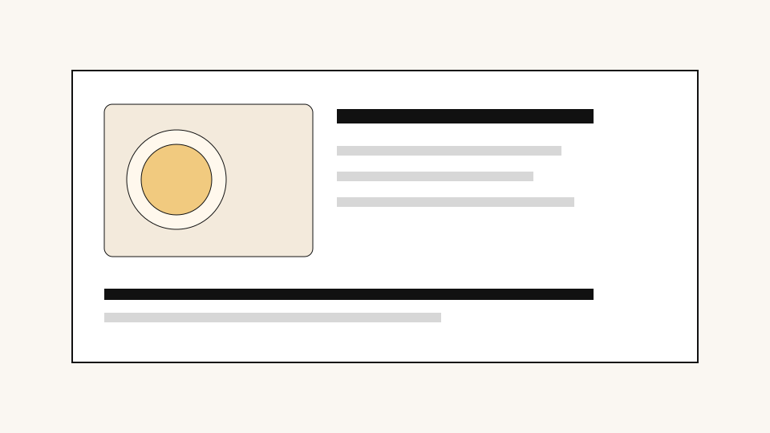

# 从 Notion 导入的一篇测试文章

这是一个给博客导入流程做测试的小样本。我想确认图片、链接、表格、视频和分节总结都能正常工作。

## 为什么要把 Notion 内容搬到博客

我平时会把读书笔记、训练记录和饮食实验先写在 Notion 里，因为它适合快速堆材料。但真正想长期保留的内容，还是更适合放回自己的博客。这样我可以慢慢整理，也更容易回头看。

这里顺手保留一个普通链接：[OpenAI](https://openai.com/)。

## 一张短表格

| 项目 | 观察 | 备注 |
| --- | --- | --- |
| 早餐 | 蛋白质更高 | 饱腹感更稳定 |
| 午后 | 咖啡减少 | 心率更平 |
| 睡眠 | 入睡更快 | 仍需继续观察 |

## 一张更长的数据表

[饮食实验原始数据](tables/long-table.csv)

## 一个视频链接

https://www.youtube.com/watch?v=ysz5S6PUM-U

## 还没想明白的部分

有些记录现在还只是原始材料，并没有变成很成熟的结论。把它们导出来，反而会逼我重新判断哪些内容真的值得保留，哪些只是当时的情绪和噪音。
