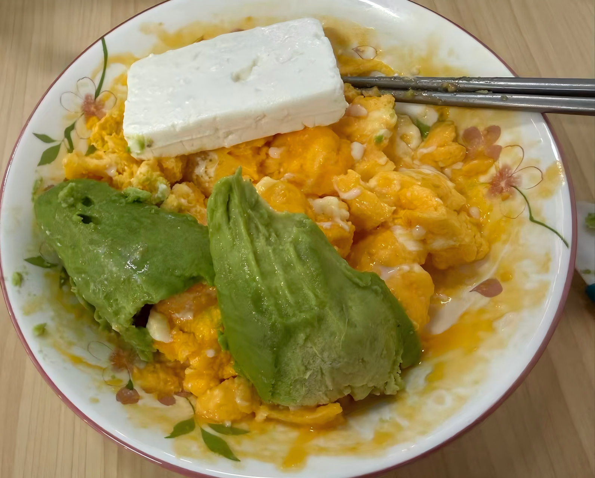
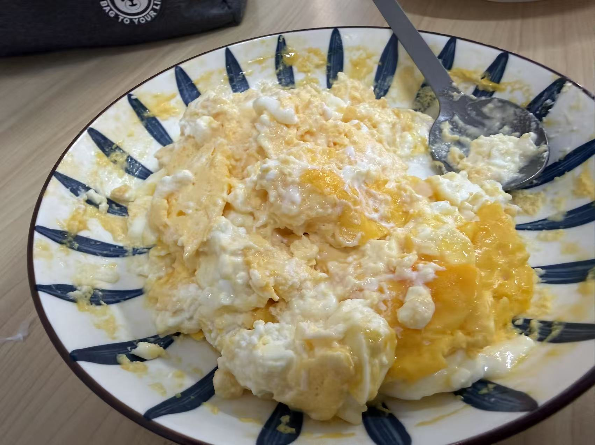
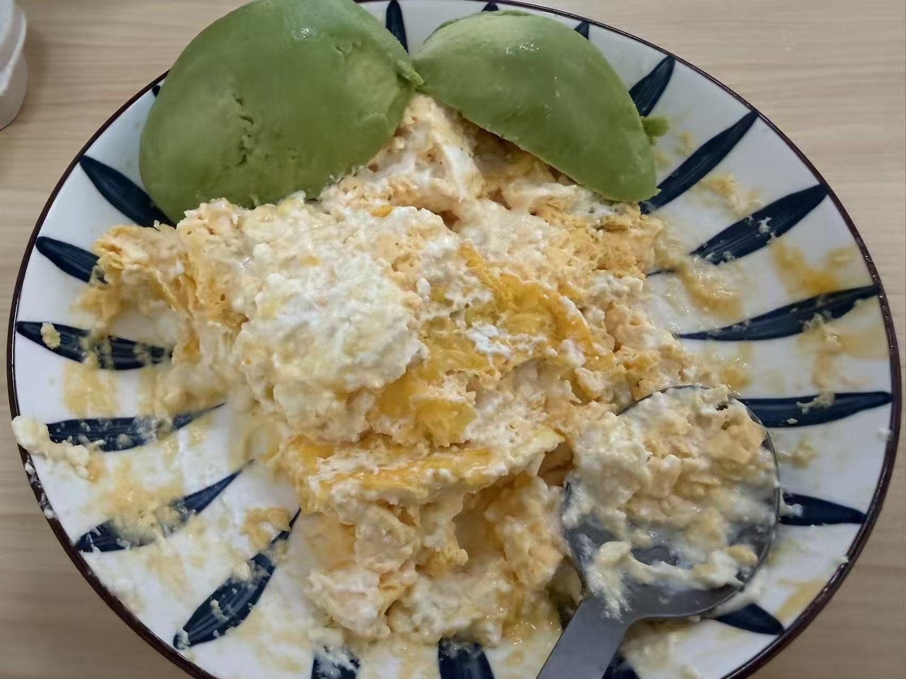
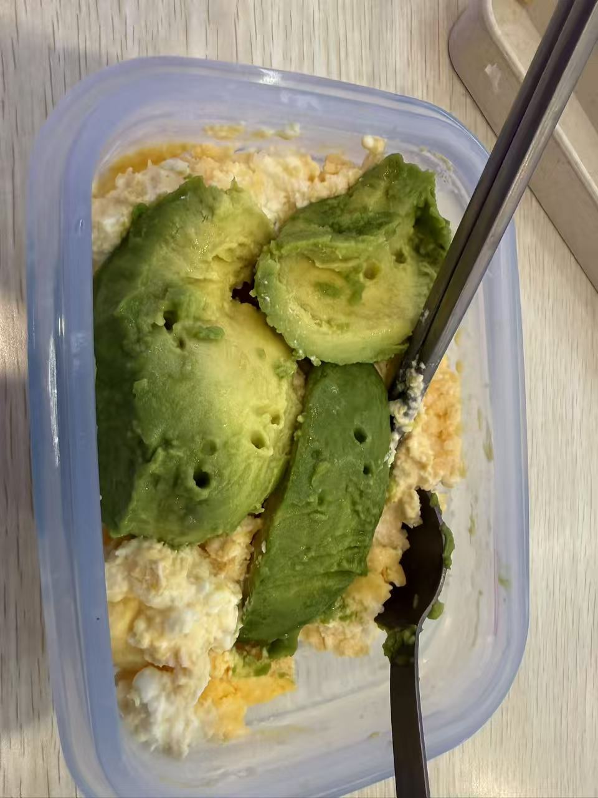

# 如何用微波炉烹饪鸡蛋？

再一个把水煮蛋剥的坑坑洼洼早晨，痛定思痛，我决定用微波炉烹饪鸡蛋。

当然，塑料和金属容器是肯定不能进微波炉的，于是我选择了两个陶瓷盘子，后面又换成了可以高温加热的硅胶餐盒。

# day1初试

于是，今天我尝试了第一次微波炉鸡蛋烹饪，以下是我的尝试步骤：

1. 圆形浅盘，打入六颗鸡蛋，筷子搅散，保鲜膜套上并扎孔，放入微波炉
2. 开启中高火，加热50s
3. 取出，观察状态：边缘微熟，内部依然是蛋液
4. 去掉保鲜膜，再次放入微波炉，中火加热40s
5. 再次取出，观察状态；用筷子主动将边缘的鸡蛋翻开推到中间
6. 反复操作3-4次，直到鸡蛋基本定型

然而，做出来的鸡蛋熟度不均匀，这是由于微波炉加热的特性，边缘的鸡蛋非常容易熟（甚至碳化），最后导致口感老；而中间的鸡蛋可以相对很生。

此外，粘在盘子上的鸡蛋非常不好清洗干净。

反思：

1. 鸡蛋没有扣盖，失去了“蒸气垫“效应，导致水分和热量无序流失，导致鸡蛋脱水
2. 反复取出放入，费时费力。
3. 没有加水，加少量水可以稀释蛋浆浓度，使得烹饪出来的鸡蛋质地更均匀。 30-50ml即可。

# day2改进

今天，我听取了ai的建议，改成了两个盘子扣在一起，形成一个“飞碟”状的容器；加入少量水后，全程采用中火加热，第一次1min，拿出来等热量重新分布（大概20s），再次加热30s

再次取出后，利用两个盘子之间的余热和“焖蒸”效应，将鸡蛋自然焖熟。

此外，我还提前将feta奶酪掰碎放入蛋液中，进一步增加风味。

这一次，风味明显改善，奶酪的味道完美融入蛋液，但是美中不足还是操作过程略微繁琐

反思：火力不够大，明天调整至中高火，并在固定节点人为进行干预

# day3

把中火改成了中高火，其他操作不变

第一波加热了1分30s，依然是液体。之后切换高火，连续加热3次，每次40s，中间拿出来把边缘凝固的鸡蛋和盘子剥离

最后中火40s收尾，依然有蛋液，但是和固体蛋搅拌在一起几乎看不出端倪。

比昨天好吃（鸡蛋整体形状更好看）

## day5 最终版

终于得到了最成功的鸡蛋，我心中的快乐无以言表

我意识到——烹饪鸡蛋，也是某种程度上的默会知识啊！