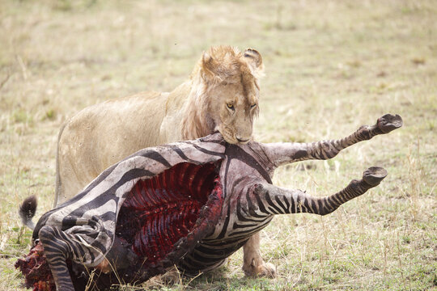
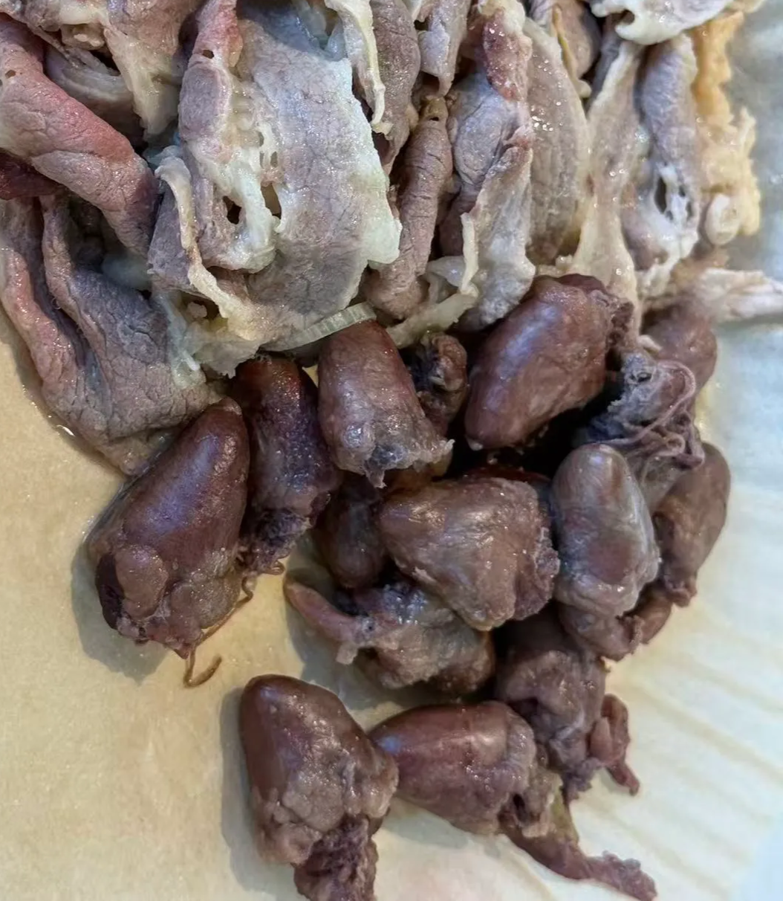
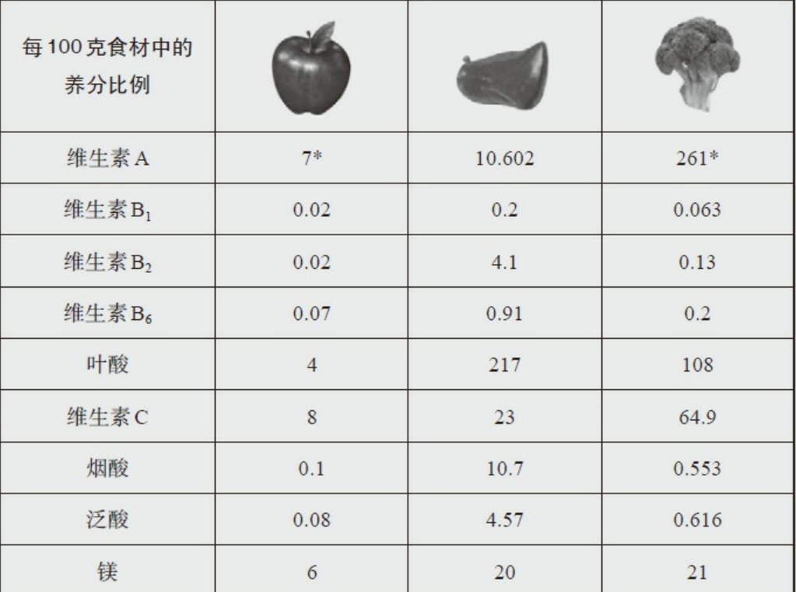
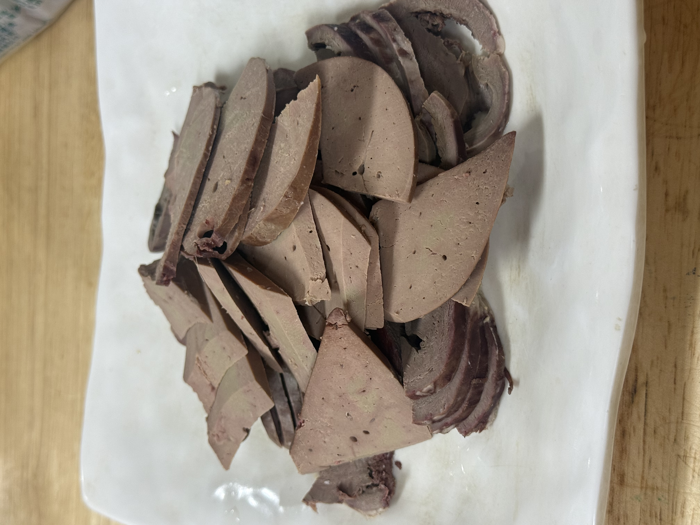
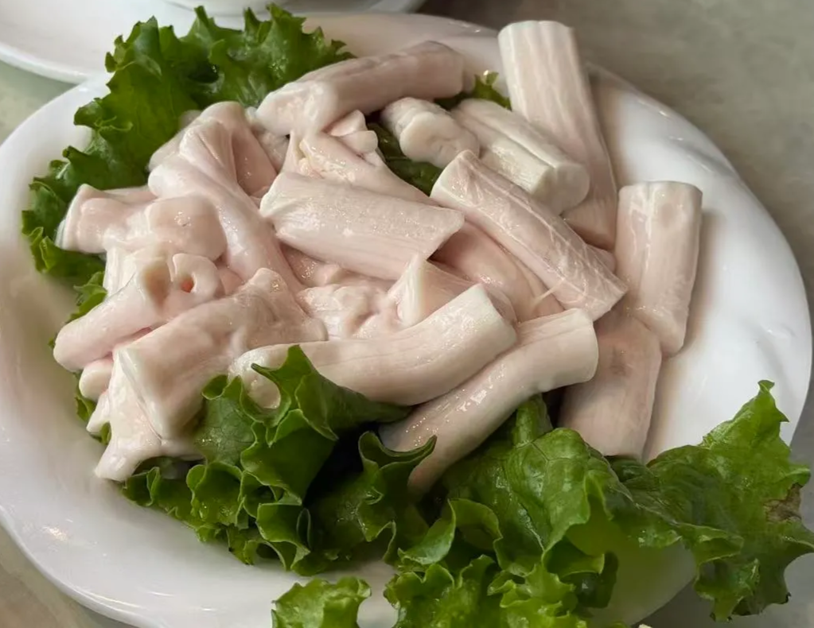
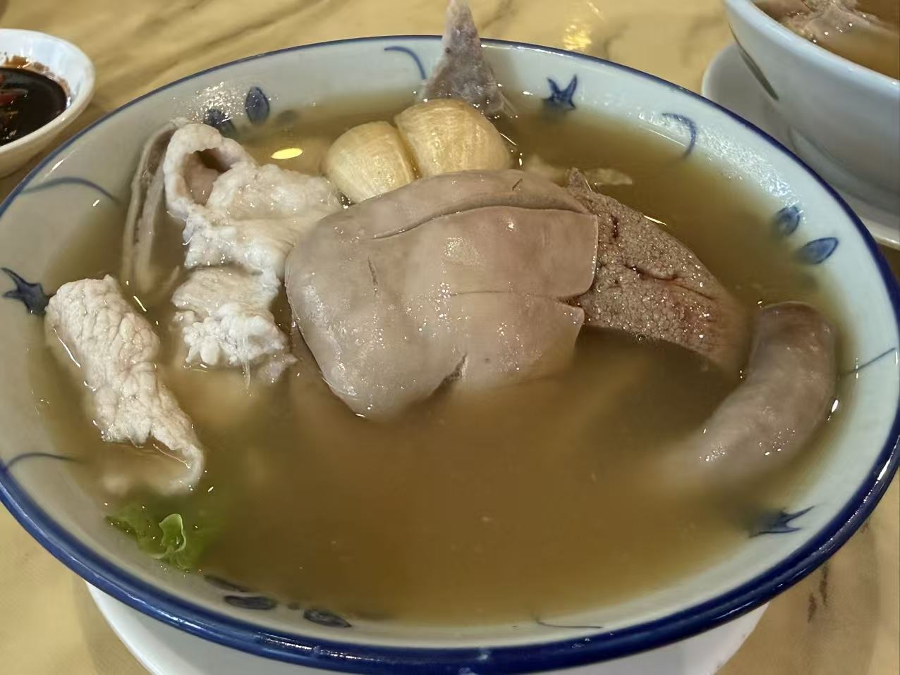

# 为什么吃内脏

自然界里，狮子把猎物扑倒咬断脖子后，会优先从腹腔这些柔软的部位开始吃；某种意义上，这在提示——内脏并不是边角料，而是动物性食物中营养密度很高的部分。

那么，为什么要吃动物内脏？日常生活中，又应该注重多吃哪些内脏，以及是否存在什么相应的禁忌？

# 一，心脏：生物发动机

鸡心是微量元素的宝库——它含有丰富的牛磺酸、辅酶Q10（与线粒体维持功能有关，同时还能抗氧化）、维生素B族（尤其是维生素b12），矿物质（钾、镁、锌、血红素铁）、以及左旋肉碱（脂肪运输的载体）。

> 心脏吃多了，胆固醇摄入过量怎么办？
> 

需要澄清的一点是，“吃进去的胆固醇=血液中的胆固醇”这一谣言早已是被淘汰的伪科学。人体的胆固醇80%左右都是自身肝脏合成的，食物只贡献了剩下的20%，而多余的胆固醇都会在人体精密的调节系统下随着粪便排出体外。

> 鸡心可以每天吃吗，一次吃多少？
> 

鸡心每周可以适当吃，但也不是可以无限制地随便吃。长期过量摄入，仍需要提防铁过载（摄入血红素铁超量）、痛风和尿酸问题（心脏的嘌呤含量比较高）。

# 二，肝脏：多维炸弹

先看一张图，这里是苹果、牛肝和西兰花的微量营养素对比图：

微量营养素对比：一图胜千言（注：植物中的维生素A形式是视黄醇和类胡萝卜素，其吸收效率远低于动物来源的维生素A

肝脏不仅是解毒器官，更是营养储存器官。

> 肝脏是我们可以买到的肉类中营养最丰富的食材。
> 

动物肝脏含有丰富的维生素A（维持视觉、免疫和上皮组织健康），B族，K2，，全面的矿物质（铁、锌、铜、硒），所有必需氨基酸以及宝贵的胆碱（这用于搬运脂肪）。肝脏最大的优点就是少量高效：一次50g-100g的猪牛羊肝就能够满足（且远远胜于）一个成年人一周的需求。

切好的羊肝

这里有几个重点和需要澄清的问题：

> B族和甲基化有什么关系？
> 

甲基化过程在生命过程中扮演重要作用，而天然叶酸（B9）和B12是甲基化的原料。同时在叶酸循环和蛋氨酸循环中，B12 作为辅因子参与同型半胱氨酸重新甲基化为蛋氨酸的过程。

然而，由于部分人天生带有MTHFR基因突变，他们无法吸收人工合成的叶酸。而动物肝脏已经把叶酸和B12完全预包装到一个“全家桶”当中，被人体高效吸收利用。

[你应该吃动物肝脏的原因是什么？_哔哩哔哩_bilibili](https://www.bilibili.com/video/BV1NM4y1D77R?t=168.5)

> 动物肝脏是解毒器官，那肝脏会含有毒素吗？
> 

不，动物肝脏排毒，但很少蓄积毒素。可以理解为：肝脏总是通过产生各种酶，把毒素降解或转化为水溶性的，然后通过尿液/粪便排出体外。

如果有条件的话，还是尽量选择草饲的动物肝脏——这是因为有毒害的重金属（比如铅、镉）可能会在肝脏蓄积，谷物饲料非常容易遭受重金属污染。

> 动物肝脏维生素A那么高，会有维生素A蓄积危险吗？
> 

有。

动物肝脏中的维生素A是视黄醇形式——和植物形态不同，它会在人体内蓄积起来，长期会导致慢性中毒。因此，必须控制好量，不要无限制地吃。

# 三，骨髓：流体黄金

瘦肉中蛋氨酸较多，而富含胶原的骨髓通常能提供更多甘氨酸——甘氨酸不仅参与谷胱甘肽合成，还与抗氧化代谢有关。

骨髓的脂肪酸组成主要是饱和脂肪和单不饱和脂肪（和牛油果一样），优秀的脂肪组成使得骨髓成为生酮人士的最佳选择之一。当然，由于它的热量过高，因此每次吃也必须严格限制好量。

白花花的牛骨髓，没什么味道。

# 四，肾脏：营养宝藏

肾脏含有丰富的B12（仅次于牛肝），B2，以及矿物质硒（保护甲状腺，改善T3水平下降）。

肾脏中还有一种叫做DAO（二氧化胺酶）的酶，这种酶可以分解组胺，降低炎症反应。

最后，维生素B5（泛酸）在肾脏中的含量也非常丰富，而B5参与合成的辅酶A（coA）也在脂肪酸氧化、酮体代谢和能量生成中扮演着重要作用。

在新加坡喝到的猪腰汤，非常美味。

# 五，怎么吃？少量，分人群

内脏的核心优势是营养密度高，因此吃法也应该是“少量、高质量、低频率”，而不是当作普通肉类大量吃。通常，健康成年人可以把肝脏控制在每周 1 次、每次约 30–50g；心脏、肾脏等可以每周 2-3次少量搭配。

内脏不是保健品，更不是药。它的价值在于以很小的食用量提供很高的营养密度。

# 最后

看到这里，扔掉你买的高价维生素B族和矿物质片吧，你的心中应该已经有了答案。

正确的食物不用太多，就能把身体带到正确的轨道上。

这让我想起一句话：

> 一天的餐数越少，对食材的要求就越高。
> 

某种意义上，这也是我一直以来坚持的原则：

less is more——少，即是多。